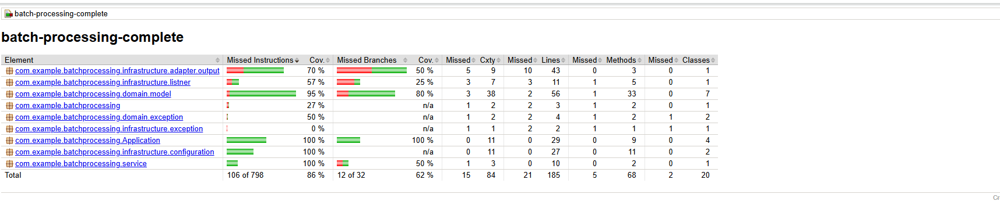

:doctype: book
:toc: left
:toclevels: 5
:sectnums:
:sectnumlevels: 5

= Tondeuse Automatique Batch Processing
:author: Zied
:toc: left
:toclevels: 3
:sectnums:


== <<introduction,Introduction>>

Ce projet implémente une solution de batch processing pour contrôler des tondeuses automatiques sur une grille de pelouse en suivant une série d'instructions. Le projet utilise Spring Batch pour orchestrer le traitement des instructions fournies via un fichier de configuration.

== <<prerequis,Prérequis>>

* Java 17
* Maven 3.x
* Spring Boot 3.3.0
* Un fichier d'entrée nommé `mower_instructions.txt` placé dans le dossier `src/main/resources`

== <<dependencies,Dépendances>>

Les dépendances principales du projet sont :

- `spring-boot-starter-batch` : Utilisé pour implémenter le batch processing.
- `spring-boot-starter-test` : Inclut JUnit et d'autres outils pour les tests.
- `spring-batch-test` : Fournit des classes utilitaires pour tester les composants Spring Batch.
- `junit-jupiter` : JUnit 5 pour écrire et exécuter les tests.

== <<project-structure,Structure du Projet>>

Le projet est organisé en utilisant une architecture hexagonale, avec des packages comme suit :

- **`domain.model`** : Contient les modèles principaux, notamment `LawnMower`, `Position`, et `Orientation`.
- **`infrastructure`** : Regroupe la configuration du batch et le repository pour accéder au fichier d'instructions.
- **`Application`** : Contient les composants du batch, tels que le `Reader`, le `Processor`, et le `Writer`.
- **`port`** : Définit l'interface `LawnMowerRepository` pour un accès découplé aux données.
- **`service`** : Contient `CommandProcessor` pour exécuter les instructions `D`, `G`, et `A` des tondeuses.

== <<batch-classes,Classes du Batch>>

=== <<batch-configuration,Batch Configuration>>

La classe `BatchConfiguration` configure le job et les steps du batch. Les principales parties sont :
- `lawnMowerStep` : Exécute les instructions des tondeuses en trois étapes : lecture, traitement, et écriture.
- `renameFileStep` : Renomme le fichier d'instructions en ajoutant un horodatage pour créer un historique.

=== <<reader,Reader : LawnMowerReader>>

Le `LawnMowerReader` implémente `ItemReader<LawnMower>` et lit les informations des tondeuses du fichier `mower_instructions.txt` via le `FileLawnMowerRepository`.

=== <<processor,Processor : LawnMowerProcessor>>

Le `LawnMowerProcessor` applique les instructions de mouvement à chaque tondeuse en utilisant `CommandProcessor`.

=== <<writer,Writer : LawnMowerWriter>>

Le `LawnMowerWriter` affiche la position finale de chaque tondeuse après exécution des instructions.

=== <<repository,Repository : FileLawnMowerRepository>>

`FileLawnMowerRepository` lit le fichier de configuration contenant les limites de la pelouse et les informations de chaque tondeuse, les charge dans des objets `LawnMower`, et les passe au batch.

== <<execution,Exécution et Génération du JAR>>

Pour générer le fichier JAR exécutable :

```bash
mvn clean install
```

Le JAR sera disponible dans le dossier `target` sous le nom `batch-processing-complete-0.0.1-SNAPSHOT.jar`.

Vous pouvez exécuter le batch avec la commande suivante :

```bash
java -jar target/batch-processing-complete-0.0.1-SNAPSHOT.jar
```

== <<batch-file,Utilisation d'un Fichier Batch (.bat)>>

Créez un fichier `run_batch.bat` avec les instructions suivantes pour exécuter le projet :

```bat
@echo off
set path="E:\jdks\java-17-openjdk-17.0.1.0.12-1.win.x86_64\bin"
java -DApp.config.file=application.properties  -jar batch-xxx-1.0.0.jar
pause
```

Exécutez `run_batch.bat` en double-cliquant pour lancer le batch sous Windows.

== <<tests,Partie Test>>

Les tests sont implémentés avec JUnit pour obtenir une couverture de code complète. Les tests incluent :

- **`LawnMowerTest`** : Valide les mouvements et rotations de la tondeuse.
- **`FileLawnMowerRepositoryTest`** : Vérifie la lecture des instructions à partir du fichier d'entrée.
- **`LawnMowerProcessorTest`** : Teste l'application des instructions de mouvement.
- **`OrientationTest`** : Teste le comportement de chaque orientation (Nord, Est, Sud, Ouest).

Pour lancer les tests :

```bash
mvn test
```

== <<coverage,Couverture de Code>>

:imagesdir: .



La couverture de code peut être générée avec JaCoCo :

```bash
mvn jacoco:prepare-agent test jacoco:report
```

Les rapports sont générés dans `target/site/jacoco` et peuvent être visualisés en ouvrant `index.html` dans un navigateur.

== <<logging,Configuration de Logging>>

La configuration du niveau de log est définie dans `application.properties`. Par défaut, le niveau de log est réglé sur `INFO` mais peut être modifié pour obtenir plus de détails :

```
logging.level.com.example.batchprocessing=DEBUG
```

== <<contribution,Contribution et Maintien du Projet>>

Le projet est conçu avec les bonnes pratiques de Spring Batch et suit une architecture hexagonale pour assurer un code bien structuré, testable et maintenable. Les contributions sont les bienvenues pour ajouter des fonctionnalités ou améliorer les performances.

== <<author,Auteur>>

Ce projet a été réalisé par Zied, en utilisant Spring Boot, Spring Batch, et des pratiques de test avancées.
```
